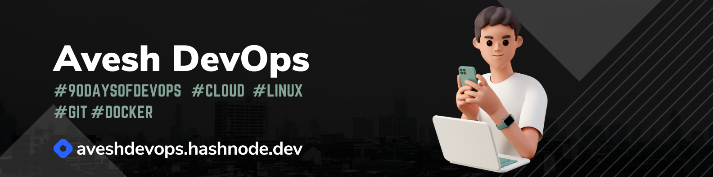

  
<h1> Hi, I am Avesh</h1>
<h2>I am currently accquiring DevOps Knowledge and enhancing my cloud and linux skill</h2>

## 🌐 Socials:
 

# 💻 Tech Stack:
            
# 📊 GitHub Stats:
 
 

## 🏆 GitHub Trophies

---

